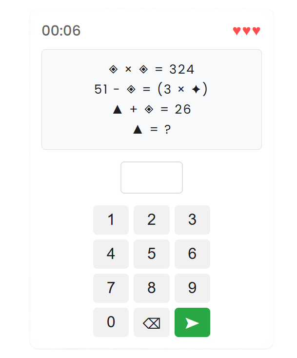

# [Play-Glyph.com](https://play-glyph.com)

A little daily logic puzzle game, kind of like Wordle but with numbers and symbols instead of letters.

**Built with:**
- React (frontend)
- Supabase (PostgreSQL, serverless functions)
- Google Cloud Console
- Deployed on Vercel

## Puzzle generation

Each puzzle is procedurally generated as a Directed Acyclic Graph (DAG), with glyphs split into solvable tiers to guarantee a unique solution. Then it walks the graph and turns it into math clues.